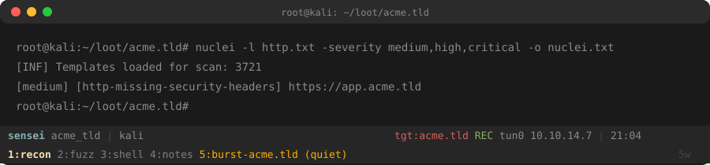
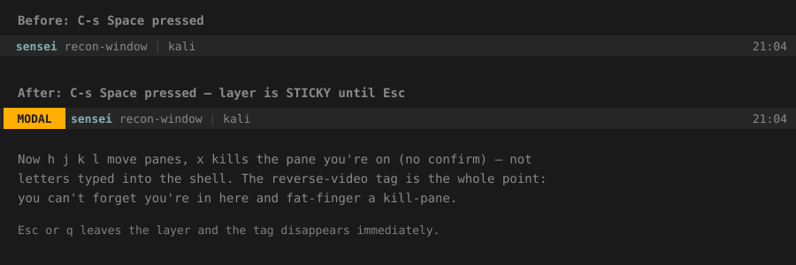
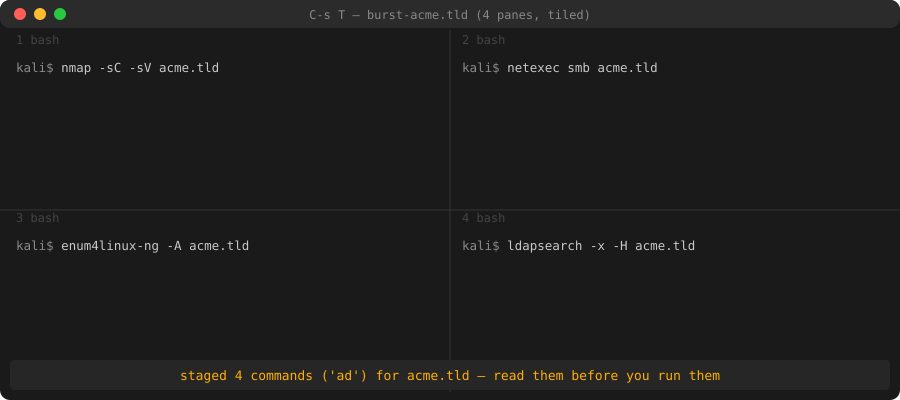
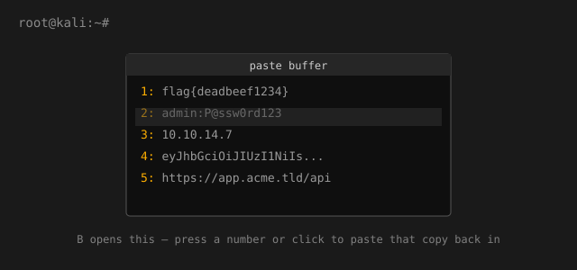
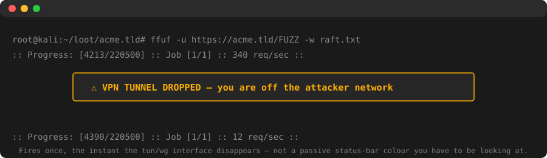
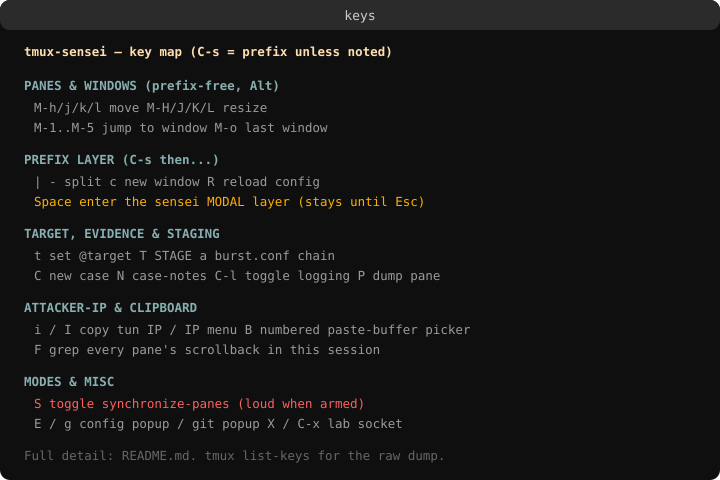

# tmux-sensei: a tmux setup built for living in the terminal

I do offensive security work — pentests, CTFs, exam-style engagements where the clock is running and a mistake isn't just embarrassing, it can be a real scope violation. Almost all of that work happens inside a terminal, and almost all of that terminal time happens inside `tmux`. So at some point the terminal setup stops being "just dotfiles" and starts being a piece of your actual toolkit.

I didn't fork anyone else's config for this. I wanted something built entirely around how *I* work, that I could keep pulling apart and rebuilding without fighting someone else's assumptions. That's `tmux-sensei` — one config file, one helper script, no plugin manager, nothing you can't read in an afternoon.

This post walks through the whole thing: why it's built the way it is, and every feature, in plain language, with pictures.

---

## The five ideas everything else follows from

Before any feature, five opinions. Every default in the config traces back to one of these:

1. **Auditable or it doesn't run.** One config file plus one script. No plugin manager silently pulling code you've never read. You can read the entire thing in a sitting.
2. **Degrade gracefully.** 256-colour only, no fancy fonts, no icons that need a special terminal. It has to look and work the same on your laptop and over a shaky SSH session into a rescue shell.
3. **tmux never presses Enter for you.** Anything aimed at a target gets *typed*, not *run*. You read it, you fix it if it's wrong, and you press Enter yourself. A scope mistake during a real engagement is a career event, not a bug report.
4. **Every session is a case file.** Logging your terminal output is one keystroke, not something you remember to set up at 3am after you've already lost the first twenty minutes of a shell.
5. **Experiments get their own sandbox.** Trying a wild new keybinding or setting should never risk breaking the session you're actually working in.

Everything below is one of these ideas turned into an actual feature.

---

## Installing it

Two ways, and the second one is the one the project actually wants you to use:

```sh
# convenient
curl -fsSL https://raw.githubusercontent.com/sudosuraj/tmux-sensei/main/install.sh | bash

# the way this config would want you to install it (read it first)
git clone https://github.com/sudosuraj/tmux-sensei
cd tmux-sensei
less install.sh
./install.sh
```

The installer stages every file to a temp directory first — if anything fails to download, nothing already installed gets touched. It backs up any tmux config you already had, and it's safe to re-run any time (it becomes an updater and only touches files that actually changed).

Restart your shell (`exec $SHELL`) after installing — that's what frees up `Ctrl-S` to become the prefix key (more on that next), and puts the `sensei` helper script on your `PATH`.

---

## The status bar — what you're looking at all day



Two lines, and colour is reserved for things that can actually hurt you if you miss them:

- **Session name and short hostname** — so you always know which box and which session you're in.
- **`tgt:acme.tld`** — the current target, shown so you can never forget which host a command is about to hit.
- **`REC`** — evidence logging is armed for this session.
- **The VPN/interface readout** (`tun0 10.10.14.7`) — the IP you're actually attacking from. It turns red and says `NO-VPN` if there's no tunnel up at all, and if the tunnel *drops* while you're working, it doesn't just sit there quietly red — it fires an actual pop-up message the instant it happens (more on that below).
- **The window list** on the second line, named by phase (`recon`, `fuzz`, `shell`, `notes`), with `(quiet)` tagged onto any window that's gone silent if you've armed silence-watch on it.

---

## The prefix, and talking to a tmux inside a tmux

`Ctrl-B` is gone. The prefix is `Ctrl-S` — that key used to mean "stop sending me terminal output" from decades-old serial terminals, and nothing uses that anymore, so the installer frees it up (`stty -ixon`) and hands it to tmux.

- **`C-s C-s`** sends a literal prefix keystroke *through* to a nested or remote tmux — useful when you've SSH'd into a box that's also running tmux.
- **`F12`** hands the keyboard *entirely* to whatever's inside the current pane. Your local tmux visibly goes deaf (the status bar dims) so you always know which multiplexer is listening to your keystrokes. Press `F12` again to take control back.

---

## Moving around without paying a "prefix tax"

Splitting panes and switching windows is something you do constantly, so it doesn't need a prefix at all — it's bound directly to `Alt`:

```
Alt+h/j/k/l     move between panes         Alt+H/J/K/L   resize
Alt+1 .. Alt+5  jump to window N           Alt+o         last window
Alt+z           zoom the current pane      Alt+g         a persistent scratch popup
```

---

## The sensei modal layer — one prefix, a whole burst of edits



tmux has a feature most configs never touch: key *tables* — a genuine modal mode, no plugin needed. Press `C-s Space` and you're in it, and — this is the important part — **it stays active until you press Escape.** That means rearranging five panes costs one prefix press total, not five.

```
h j k l   move          H J K L   resize
o         main-vertical layout    e   tiled layout
x         kill pane                m   swap pane
Esc / q   leave
```

Being "sticky" is exactly why it needs a loud indicator: while you're in this layer, plain letters do real things — `x` kills the pane you're on, no confirmation. So the status bar shows a reverse-video **`MODAL`** tag the entire time it's active, impossible to miss and impossible to mistake for anything else. It disappears the instant you press Escape.

---

## Copy-mode as a grep layer

Scrollback is evidence, and these are the things you actually go hunting for in it. Enter copy-mode with `C-s [`, then:

```
Alt+i   IPs (with optional :port)      Alt+u   URLs
Alt+x   hashes (md5/sha)               Alt+t   tokens & keys (JWT, AWS keys, GitHub tokens, PEM blocks)
Alt+s   secret-looking words (token, api_key, password, authorization…)
Alt+e   errors (ERROR, Traceback, denied, refused, 403, 500…)
```

One key each, instead of piping a pane through `grep` by hand every time. Selecting text and pressing `y` copies it — over OSC 52, which means it lands on your real clipboard even from inside a remote SSH session.

---

## Evidence logging: the "I forgot to hit record" problem, solved

`C-s C-l` toggles logging for the whole session. Every pane's output starts streaming to `~/loot/<session>/panes/`, and — this matters — **arming it retro-fits every existing pane**, not just new ones. If you turn it on ten minutes into a shell, it also backfills whatever's already sitting in that pane's scrollback, so "I should've turned this on earlier" doesn't cost you the first ten minutes of evidence.

`C-s P` dumps just the current pane's scrollback to the case folder on demand, any time.

---

## Case management: one command, a whole workspace

```
sensei case acme.tld
```

This builds you a session with four windows already named by phase — `recon`, `fuzz`, `shell`, `notes` — a loot directory to match, and sets `acme.tld` as your target automatically. Run it again on the same name and it just switches you back into the existing session instead of duplicating anything.

---

## Burst: staging a whole recon chain without ever running it



This is the "tmux never presses Enter for you" law made concrete. `C-s t` sets your target, `C-s T` opens a tiled window and *types* a whole chain of commands into as many panes as the chain needs — and then stops. Nothing runs.

The chain itself isn't baked into the tool at all — it comes entirely from a file you own, `~/.config/tmux/burst.conf`, as named profiles:

```
[web]
subfinder -silent -d {target} | anew subs.txt
httpx -l subs.txt -sc -title -tech-detect -o http.txt
nuclei -l http.txt -severity medium,high,critical -o nuclei.txt

[ad]
nmap -sC -sV -oA nmap-{target} {target}
netexec smb {target} -u '' -p '' --shares
enum4linux-ng -A {target}
```

`{target}` gets swapped for whatever you set with `t`. One profile and `T` runs it straight away; more than one, and it pops a menu so you pick per engagement instead of the tool guessing whether you're doing a web assessment or an internal AD box. Either way, you get a screen full of correctly-typed commands sitting at their prompts, and you press Enter on each one yourself, after you've actually read it.

---

## Finding a needle across a dozen panes

Copy-mode's grep-layer only searches the pane you're already looking at. Once you're eight panes deep into an engagement, that's not enough — so `C-s F` asks for a search term and greps *every pane in the session* at once, then shows you a pick-list of which panes actually matched, with a hit count for each. It checks the last 5000 lines of each pane by default (a full scan of a pane that's been running for hours would mean a real, felt pause — you can lift that limit if you genuinely need to search further back).

---

## A numbered picker for the things you just copied



Every copy you make with `y` (or a mouse drag) lands in a numbered tmux buffer. `C-s B` opens a picker showing the last nine, each with a preview of its actual content, so getting back the IP you copied three actions ago is one keypress instead of digging through `tmux choose-buffer`'s bare list.

---

## Broadcasting to every pane — deliberately loud

`C-s S` toggles `synchronize-panes`, a real tmux feature that was never actually bound to a key here until recently. It's genuinely useful — running the same command against several hosts open in parallel panes — and genuinely dangerous if you forget it's on and type into a pane you thought was private, including an SSH session into a client's box. So arming it is loud on purpose: every pane border and the status bar itself show a literal `[SYNC]` tag, not just a colour, so it still reads correctly even on a plain black-and-white serial console.

---

## Knowing which scan has actually stalled

Each pane's border now shows how long its current command has been running — `nmap (12m)`. Paired with silence-watch's `(quiet)` tag on a window that's gone silent, that's the difference at a glance between "still grinding" and "this has been hung for twenty minutes and I didn't notice."

---

## The VPN indicator that actually pages you



The status bar always shows your tunnel interface and IP, and turns red the moment there isn't one. But a red label only helps if you're already staring at the status bar — a dropped VPN in the middle of a long scan is exactly the kind of thing you can miss for twenty minutes. So the instant the tunnel interface disappears, it fires an actual on-screen alert, once, right when it happens — not a colour you have to notice, an interruption you can't avoid.

---

## Saving and restoring a whole layout

```
sensei save        # snapshot every session's windows, panes, and working directories
sensei restore     # rebuild that exact layout
```

This rebuilds *geometry and working directories* — it deliberately does **not** re-run whatever processes were in each pane. Which commands re-run against a live target is always your decision, never something the tool decides for you after a crash or reboot.

---

## Real ghost-text as you type, not just history search

```
sensei setup-shell
```

This is the one thing here that touches your *shell*, not tmux — and it only does it if you ask. For `zsh`, it wires in `zsh-autosuggestions` if it's installed: type a few letters and a greyed-out completion from your history appears, right-arrow to accept it. For `bash`, it looks for [`ble.sh`](https://github.com/akinomyoga/ble.sh), which gives bash the same live, per-keystroke experience; if you haven't installed either yet, it falls back to a working prefix-search on the up/down arrows and prints the actual install command for the real thing (never a `curl | bash`).

---

## The lab: a place to break things on purpose

You will break your tmux config while experimenting with it — that's the whole point of owning your setup instead of just using someone else's. `C-s X` opens a completely separate tmux session on its **own socket**, with its own config, a loud purple bar that's impossible to confuse with a real session, and its own prefix (`C-a` instead of `C-s`) so muscle memory can't betray you. `C-s C-x` burns it to the ground from your real session, instantly, with zero effect on anything you're actually working on.

---

## Trying an idea without committing to it

Not every idea deserves to go straight into the main config. There's a ladder here for exactly how committed you are to something:

1. **Type it at tmux's own `:` prompt.** Zero commitment — try any tmux command live, right now. A reload wipes it away.
2. **`sensei experiment my-idea`** — for something you want to live with for a day or two. It scaffolds a file at `~/.config/tmux/local.d/my-idea.conf` and opens it in your editor. Every file in that folder gets sourced automatically (in filename order) after your personal overrides. Delete the file, and the idea is gone — no hunting through one giant override file to undo it.
3. **`~/.config/tmux/local.conf`** — once something's proven itself, this is where it lives permanently. It's created empty on install and never touched by an update.

One honest caveat worth knowing: deleting a `local.d` file and reloading correctly reverts any *setting* it changed, but a *key binding* it added does not automatically un-bind itself — that's just how tmux reloading works (it re-applies commands, it doesn't reset state first). If an experiment adds a key you might want to remove later, `unbind` it explicitly before deleting the file.

---

## Making it look like yours

Every colour in the config is a plain 256-colour index, and there's a complete legend at the top of the file mapping every single one to what it means — the "sensei" wordmark, the warning colour, the target label, the dimmed F12 state, all of it. Retheming is a matter of overriding the specific `set -g …-style` lines in `local.conf`; the base file never needs touching.

---

## The full key map, one popup away



`C-s ?` opens a categorized cheat sheet of everything above — not tmux's raw, unfiltered dump of every binding in every table, but a curated view of what's actually been customized here, organized by what you're trying to do (panes, evidence, staging, clipboard, experimentation).

---

## What it deliberately refuses to do

- **No process resurrection.** `restore` gives you geometry, not re-run commands.
- **No auto-run of anything network-facing.** `burst` stages and stops, always.
- **No telemetry, no phone-home, no plugin fetch.** The only network traffic this config ever makes is the one-time install you can read before you run.

---

## The point

None of this is trying to be a general-purpose tmux config for everyone. It's mine — shaped entirely around a security researcher's actual day, tested by hand against a real tmux server rather than assumed to work, and built so that trying a new idea is always cheap and undoing a bad one is always safe. If you do this kind of work too, fork it and make it yours instead — that's the whole design.
